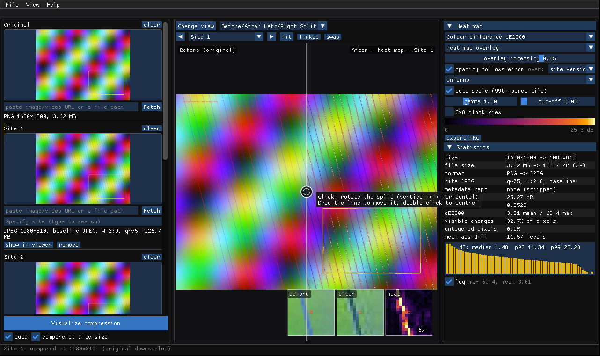

# CompressCompare

A small, fast C++17 desktop app that shows **where** a social-media site (or any upload pipeline) changed
your image or video. Load the original and the copy you downloaded back from Instagram, X, Facebook,
TikTok, Discord, … (a file or a pasted URL), and compare them Lightroom-style with a per-pixel difference
**heat map** you can overlay on the picture and dial in and out – next to the numbers: PSNR, SSIM, ΔE2000,
the JPEG quality and chroma subsampling the site used, and whether your metadata survived.

This is version 0.3, the **macOS port**: it targets macOS 12 Monterey or newer on Intel Macs and was designed
around a 2015–2017 MacBook Air (dual-core i5, Intel HD Graphics 6000, 8 GB). It is built with Dear ImGui,
GLFW and OpenGL 3.3, and does its image work with OpenCV, on the GPU through OpenCL where the driver passes a
self-test. It sleeps when idle, so it costs next to nothing while you look at a result. The same code builds
on Linux for development and CI.



## Requirements

- macOS 12.0 or newer on an Intel (x86_64) Mac;
- the Xcode Command Line Tools (`xcode-select --install`) and an internet connection for the first build.

Nothing else: CMake is downloaded if it is missing, OpenCV is built from source, and the small libraries are
fetched by CMake. Homebrew is not needed (it no longer supports macOS 12). `ffmpeg` is optional; see below.
There is no prebuilt app – you build it on the Mac that runs it.

## Quick start

```
scripts/build-macos.sh
open dist/CompressCompare.app
```

The script checks the tools, builds a static OpenCV 4.12.0 into `deps/` (the first time only: about 20–30
minutes on a dual-core MacBook Air), builds the app, runs the tests, installs `dist/CompressCompare.app`,
signs it ad hoc and prints what it found (OpenCL device, video back-end, decoders). `--no-tests` skips the
tests, `--clean` starts the app build afresh. To open the samples:

```
open -a "$PWD/dist/CompressCompare.app" --args "$PWD/samples/original.png" "$PWD/samples/instagram.jpg"
```

Details, the manual steps and troubleshooting: [Build on macOS](docs/how-to/build-macos.md). Then follow the
ten-minute tutorial: [Your first comparison](docs/tutorials/first-comparison.md).

On Linux (development, CI): `scripts/build-deps.sh`, then `cmake --preset linux-system`,
`cmake --build --preset linux-system` and `ctest --preset linux-system` – see
[Build on Linux](docs/how-to/build-linux.md).

## What OpenCV and OpenCL do here

- **Decoding.** Stills are decoded with OpenCV's `imgcodecs` and the codecs bundled with it (libjpeg-turbo,
  libpng, libwebp, libtiff, plus GIF and BMP); JPEGs come out with their EXIF orientation applied. On macOS,
  ImageIO decodes iPhone HEIC/HEIF photos (and AVIF on macOS 13+) and converts them to sRGB.
- **Video.** `cv::VideoCapture` reads MP4 and MOV through AVFoundation on macOS, with the Mac's hardware
  H.264/HEVC decoder, so no external program is needed. Portrait phone videos are turned upright from the
  track header's rotation.
- **Computation.** Resampling (in linear light), the six heat-map metrics and the statistics run on
  `cv::UMat`: through OpenCL on the GPU when enabled, otherwise with OpenCV's SIMD code on all cores. The
  steps OpenCV has no function for are small OpenCL kernels, each with an identical CPU twin. In the default
  `auto` mode OpenCL is switched on only after a start-up self-test shows that the GPU reproduces the CPU
  results; otherwise the app stays on the CPU. [How to use the GPU](docs/how-to/use-the-gpu.md) shows how to
  check and change this, and how to benchmark it with `cc_bench`.
- **ffmpeg** (optional) is run as an external program only for what the above cannot open: WebM, MKV, FLV
  and similar containers, AVIF on macOS 12, and AVIF/HEIC on Linux. See
  [Install ffmpeg](docs/how-to/install-ffmpeg.md).

## Documentation

The documentation lives in [`docs/`](docs/index.md) and follows the [Diátaxis](https://diataxis.fr/)
framework – four kinds of page, each with one job:

| | |
|---|---|
| **Tutorials** – learn by doing | [Your first comparison](docs/tutorials/first-comparison.md) · [Comparing a video](docs/tutorials/video-comparison.md) |
| **How-to guides** – get a job done | [Build on macOS](docs/how-to/build-macos.md) · [Build on Linux](docs/how-to/build-linux.md) · [Use the GPU](docs/how-to/use-the-gpu.md) · [Install ffmpeg](docs/how-to/install-ffmpeg.md) · [Load from a URL](docs/how-to/load-from-a-url.md) · [Change a setting with config.yaml](docs/how-to/change-config.md) · [Add a site](docs/how-to/add-a-site.md) · [Export a heat map](docs/how-to/export-a-heat-map.md) · [Run the tests and static analysis](docs/how-to/run-tests-and-static-analysis.md) · [Generate the API docs](docs/how-to/generate-api-docs.md) |
| **Reference** – look it up | [config.yaml keys](docs/reference/config.md) · [Command line](docs/reference/cli.md) · [Keyboard shortcuts](docs/reference/keyboard-shortcuts.md) · [Metrics](docs/reference/metrics.md) · [Site database](docs/reference/sites.md) · [Architecture](docs/reference/architecture.md) |
| **Explanation** – understand why | [How a comparison works](docs/explanation/how-it-works.md) · [Design principles: config.yaml, docstrings, Power of 10](docs/explanation/design-principles.md) · [Where the ideas come from](docs/explanation/references.md) |

## What it does

- **Original + N site slots.** Each slot takes a file (native dialog, drag-and-drop, `Cmd+V`) or a URL, and
  has a fuzzy *Specify site* box (`ig`, `twtr`, `fb`, `bsky`…). Pasting a URL auto-detects the site from the
  CDN host. Hovering a site name tells you what it typically does to uploads.
- **Visualize compression.** The original is resampled to the site's output size (sRGB-aware), then PSNR,
  SSIM, ΔE2000 statistics and a per-pixel heat map are computed on a background thread, on the GPU where
  possible.
- **Heat map.** Six metrics (absolute difference, luma difference, ΔE76, ΔE2000, 1−SSIM, squared error),
  six colour maps, overlay with intensity, "opacity follows error", gamma, cut-off, auto (p99) or manual
  scale, 8×8 JPEG block view, PNG export.
- **Lightroom-style views.** Loupe, Before/After Left/Right and Top/Bottom, draggable Split variants,
  Survey of every site; linked zoom and pan, wheel or trackpad zoom about the cursor with fit / 100 % / 200 %
  snaps, nearest-neighbour at 100 % and above so you see real pixels; a corner loupe and a pixel read-out
  under the cursor. On macOS the `Ctrl` shortcuts are `Cmd`.
- **JPEG forensics.** Quantisation tables → estimated IJG quality, chroma subsampling, baseline vs
  progressive, EXIF/ICC survival; file types sniffed from bytes, not names.
- **Video.** Metadata, size caps, frames at any timestamp, a timeline, and "sample quality over time"
  PSNR/SSIM plots – without ever decoding a whole video into memory.
- **Every number in one file.** `config/config.yaml` holds every tunable value and the site database and is
  compiled into the executable; a per-user `config.yaml`
  (`~/Library/Application Support/CompressCompare/` on a Mac, `~/.config/compresscompare/` on Linux)
  overrides any part of it, and Settings > *edit config.yaml...* creates and opens it. `--check-config` validates a file without opening a window.

## Command line

```
compresscompare [--config FILE] [--exit-after SECONDS] [file ...]
compresscompare --check-config | --system-info [--config FILE]
compresscompare --help | --version
```

On macOS the program is `CompressCompare.app/Contents/MacOS/CompressCompare`. Files fill the slots in order
(original first); `--system-info` prints the OpenCV version, the OpenCL device and whether it is in use, the
video back-end and the still decoders. See the [command-line reference](docs/reference/cli.md).

## Engineering rules

The code follows NASA/JPL's *Power of 10* rules adapted to a desktop application – no recursion, no
`setjmp`, bounded loops, functions ≤ 60 lines, contracts that recover (`CC_REQUIRE`/`CC_ENSURE`), every
return value checked, `-Wall -Wextra -Wpedantic … -Werror`, clang-tidy and cppcheck clean – with Doxygen
docstrings on every declaration and no magic numbers. Where a rule is relaxed (callbacks for C libraries,
per-job allocation, the event loop) the source says so; exceptions from yaml-cpp and OpenCV are caught where
those libraries are called. The full rule-by-rule account is in
[Design principles](docs/explanation/design-principles.md); the checks are run as described in
[Run the tests and the static analysis](docs/how-to/run-tests-and-static-analysis.md).

## Layout

```
CMakeLists.txt, CMakePresets.json   build (presets: macos-intel, macos-intel-debug, linux-system)
scripts/          build-macos.sh (one-command macOS build), build-deps.sh (static OpenCV 4.12.0 into deps/)
cmake/            dependency discovery with FetchContent fallbacks; config.yaml embedding
packaging/macos/  Info.plist template and app icon for CompressCompare.app
config/           config.yaml – every tunable value and the site database
src/core/         the library: config, OpenCV/OpenCL set-up and kernels, image I/O and sniffing, macOS ImageIO,
                  JPEG parser, metrics, video, fuzzy search, sites, HTTP, processes, ffmpeg, threading
src/gpu/          explicit OpenGL 3.3 loader, compare shader, renderer
src/app/          application state and jobs, slots panel, compare view, right panel, fuzzy combo
src/platform/     native file dialogs
src/util/         string helpers, contracts
tests/            eight ctest programs (config, fuzzy, metrics, jpeg_info, ffprobe, sites, opencl, video),
                  plus opencl_cpu_device (test_opencl on a CPU OpenCL device)
tools/            cc_bench (CPU / OpenCL benchmark), generators for the config and site reference pages,
                  function-length checker
docs/             the documentation (Diátaxis), screenshots
samples/          synthetic images and clips for the tutorials and tests
```

## Licence

MIT for this project's own code (see `LICENSE`). Third-party components (OpenCV and the codecs bundled with
it, Dear ImGui, GLFW, yaml-cpp, libcurl), the CLIJ2 kernels the metric code is modelled on and the design
references are listed with their licences in `THIRD_PARTY_NOTICES.md`.
